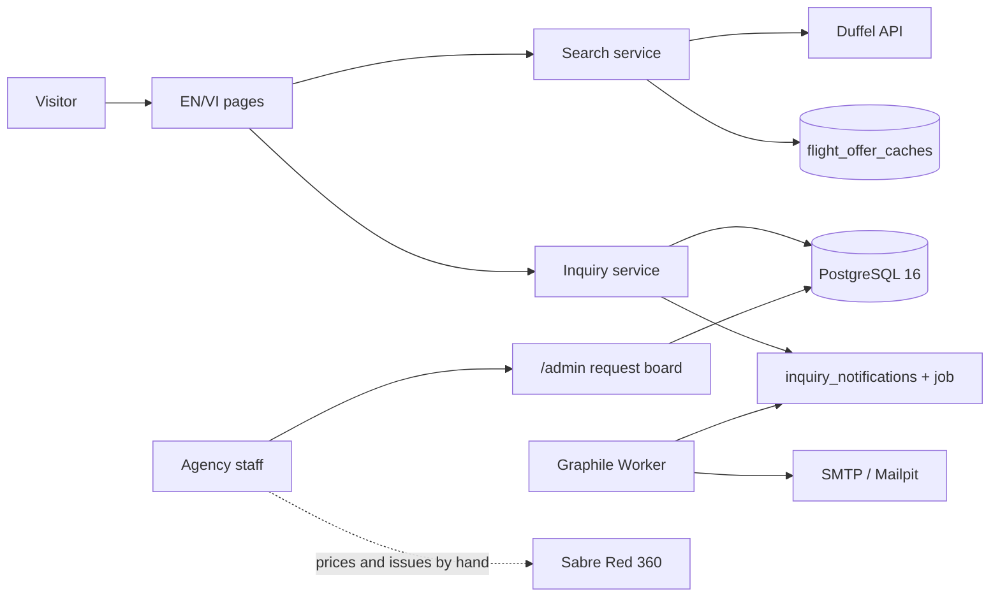
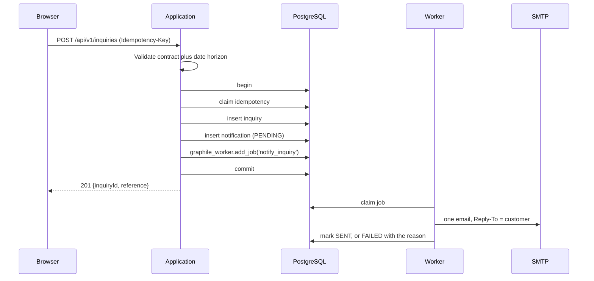

# Technical architecture

**Status:** Implemented  
**Updated:** 2026-08-08

The scope this describes was set by [ADR 0003](decisions/0003-intake-only-site.md): the site shows live fares and collects callback requests. Everything after the callback happens in the agency's Sabre Red 360 terminal.

## 1. Shape

One Next.js application plus a Graphile Worker process, sharing one PostgreSQL database.



No Redis, no queue broker, no GraphQL, no per-table repository abstraction, and no network call inside a database transaction.

## 2. Layout

```text
src/
  app/
    [locale]/       landing, flights, request, legal pages
    admin/          the request board and its sign-in form
    api/v1/         health, inquiries, admin session and status, search
  components/
    customer/       search UI and the request wizard
    admin/          the board, the cards, sign in and out
    shared/         header, footer, form primitives
  modules/
    inquiries/      validation, creation, the agency email
    search/         offers and the fare calendar
    workflows/      idempotency, errors, canonical JSON
  server/
    db/schema/      Drizzle schema
    integrations/   Duffel, SMTP, clock
    jobs/           Graphile task list and handlers
    admin-auth.ts   the /admin password and session cookie
    container.ts    dependency composition
  proxy.ts          locale routing plus the /admin gate
  worker.ts
drizzle/            committed SQL migrations
scripts/            setup, migrate, reset, worker-once
tests/              unit, integration, security, E2E
```

Route handlers validate input, call one service, and serialize the result. Interfaces exist only where a deterministic local substitute is needed: `FlightSearchProvider`, `EmailSender`, `Clock`.

## 3. Data

Four tables plus Graphile Worker's own schema: `inquiries`, `inquiry_notifications`, `idempotency_keys`, and `flight_offer_caches`.

`inquiries` holds exactly what a callback needs: name, email, phone, preferred contact method, language, destination, dates, flexibility, cabin, party size, visa interest, assistance and notes, the two consent timestamps, and a `NEW` / `PROCESSING` / `DONE` status. A `TV-…` reference is the human handle. No passport, payment, or document data exists anywhere in the schema.

Column checks reject carriage returns and newlines in the name, email, and phone columns. Those values reach an email header, and the contract and the sender enforce the same rule, so a bypass at any one layer still cannot forge a header.

`flight_offer_caches` is a cache, never business evidence. Rows carry the fetch time and are re-fetched past a freshness horizon.

## 4. Request intake



The job is enqueued inside the transaction, so it cannot become visible before the row it reads, and a rollback takes the job with it. It is also enqueued at a negative priority, so a customer waiting for a callback is never behind whatever else the worker picks up. A retried submission returns the first result rather than creating a second lead. Delivery failure is recorded and rethrown: the row keeps a reason a human can read, and the worker keeps its backoff across eight attempts.

## 5. Search

Every offer is a live Duffel offer request. There is no fallback provider in `src/`; the deterministic fake used by tests lives in `tests/helpers/`. Offers not priced in USD are dropped rather than converted.

Duffel allows 10 offer requests a minute and bills for each one, so a search only happens when a customer names their dates and asks: the date picker is a plain calendar, and prices appear in the results below it. A result set is cached under its search parameters, and the cache-miss path also drops rows that expired more than a day ago, so nothing sweeps in the background. Near-duplicate offers (same carrier, same outbound, same price) are grouped so one itinerary does not fill the page. The constants and their reasoning are in [ADR 0002](decisions/0002-live-flight-shopping-preview.md).

## 6. Access control

There is no customer account, so there is nothing to authenticate on the public side. The only credential is `ADMIN_PASSWORD`, guarding `/admin` and `/api/v1/admin/*`. There is no username and no user table: the agency is two people sharing one password.

Signing in posts the password to `/api/v1/admin/session`, which compares it in constant time — both values are digested with Web Crypto SHA-256 and the results XORed, so timing reveals neither length nor content — and returns an HttpOnly, SameSite=Strict cookie holding `v1.<expiry>.<HMAC-SHA256>`. The signing key is derived from the password, so rotating `ADMIN_PASSWORD` invalidates every outstanding session; that is the revocation mechanism, and the reason there is no session table. Sessions last eight hours. Failed attempts are rate limited per caller in process memory, ten in fifteen minutes.

`src/proxy.ts` checks the cookie before anything renders, and `src/app/admin/page.tsx` and the status route check it again — a matcher regression must not be the only thing between customer contact details and the internet. A browser is redirected to `/admin/login`; an API call gets a 401 it can read. Both carry `no-store` and `noindex`. Web Crypto rather than `node:crypto` because the proxy may execute outside the Node runtime.

Mutation routes require a trusted origin and an idempotency key. Security headers deny framing, MIME sniffing, unneeded device capabilities, and referrer leakage.

## 7. Local dependencies

Compose runs PostgreSQL and Mailpit on loopback ports. Web and worker run on the host. Tests create isolated databases whose names end in `_test`, on loopback only, migrated fresh and dropped afterwards; reset scripts refuse anything else.

The app requires a Duffel token to boot outside tests. CI sets `APP_ENV=test` because it holds no credential.

## 8. Not in this repository

No deployment or infrastructure-as-code. Production secrets, email deliverability, backups, monitoring, rate limiting, legal copy review, and operational runbooks remain deployment responsibilities and launch gates.
